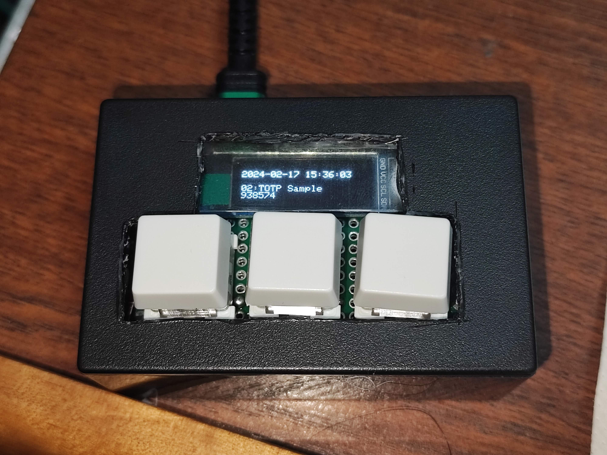

# TOTP Keyboard for CH32V203

多要素認証(MFA)のコードを自動的に入力する USB キーボードです。
CH32V203C8 で動作確認していますが、K8 でも動くと思います。

TOTP コードの計算には、
[TOTP-MCU](https://github.com/Netthaw/TOTP-MCU/tree/master)
を使用しています。
現状では6桁決め打ちですが、有名どころはすべてそうですので問題ないかと思います。

`totpkey.h` に秘密鍵を書き込みます。
例として、PyOTP のサンプルキーが登録されていますので、https://totp.danhersam.com/ で確認することができます。
Base32 でエンコードされている場合は、[適当なデコードツールで](https://cryptii.com/pipes/base32)デコードしてください。
耐タンパー性とか考慮していないので、秘密鍵が盗まれたくないような場合にはコードプロテクションを掛けてください。

`main.c` の先頭に TIMEZONE 設定と、unlock コードの設定がありますので、適宜変更してください。
unlock コードは 1,2,8 が、それぞれ左、右、OKボタンを示しています。

デフォルトではフルキーボードの `0-9` のキーを押したことになります。
メインのキーボードで Shift などが押されていると、違うキーが入力されます。(すくなくとも Windows では)
キーの入力間隔が短いと、取りこぼしが発生することがありますので、発生した場合は `KEYINTERVAL` の値を調整してください。

# 接続

必要なものは以下の通りです

- SSD 1306 OLED (128x32 pixels)
- キースイッチ (3個)
- NRST / Boot0 用スイッチ (USB経由でファームウェアを書き込むため)
- RTC 用水晶発振器(32.768kHz) + コンデンサ
- RTC 用電池(コイン電池) + (ショットキー)ダイオード
- USB コネクタ
- USART 用ピンヘッダ
- 3.3V LDO
- パスコン
- プルアップ抵抗

それぞれ以下のように配線します。

*   OLED   -> PB6/PB7
*   Keypad -> PB0(Left)/PB1(Right)/PB3(OK)
*   USBD   -> PA11/PA12
*   USART1 -> PA9/PA10
*   Xtal (32.768kHz) -> PC14/PC15

参考回路図はこんな感じになります。

# 使い方

最初は RTC が初期化されていませんので、時刻入力待ちになります。
YYMMDDhhmm の形式でシリアルポートから時刻を入力します。
RTC を設定すると、通常動作モードに移行します。

世の中の　MFA を利用するサイトでは、同期処理として登録時に 2 個の連続したコードを入力するように求められると思いますので、

最初に時間設定→秘密鍵の設定＆リビルド→FW更新→サイトとの同期

の順で登録することになるかと思います。

# モード

- PC 接続待ち

PC と USB 接続されると、次の待機モードに移ります。
USB 接続が切れると、接続待ちモードに戻ります。

- 待機モード

キー入力待ちモードです。何かキーを押すと、アンロックモードに移ります。
キー入力が一定時間ない場合に、待機モードに戻ります。

- アンロックモード

設定したキーの組み合わせ(6個)を順に入力して解除します。
ロックに失敗すると、待機モードに戻ります。

- TOTP 入力モード

左右キーでコード選択。OK でコードを入力します。

- RTC 設定モード

TOTP 入力モードで、最後のキーの次のキーの代わりに、RTC 設定モードが表示されます。
OK を押すと、設定モードに入ります。

設定モードでは時刻調整(プラスマイナス30秒)ができるので、00秒のタイミングで　OK を押すと時刻設定されます。
2回目以降で「前回の時刻設定から 100000 秒以上経過している」場合には、RTC の微調整が同時に実行されます。

# 解説

今回は RTC と USBD の組み合わせということで、MFA コード入力キーボードを作ってみました。

USB は、WCH SDK の CompositeKM をほぼそのまま使っています。
元々キーボードとマウスの機能がありましたが、マウスの機能を削除しています。

RTCも SDK ほぼそのままです。ただ水晶の精度があまりよくないので、Calibration レジスタを使った補正機能をつけています。
TOTP の仕様上、サーバ上で多少のずれは許容するようになっているとはおもいますが、念のため付けました。

100万秒(=２週間)以上の間隔を開けて時間調整すると、ほぼ正確な値になるんじゃないかと思います。

最初の時刻設定はキースイッチでやる方がいいのかな…？
